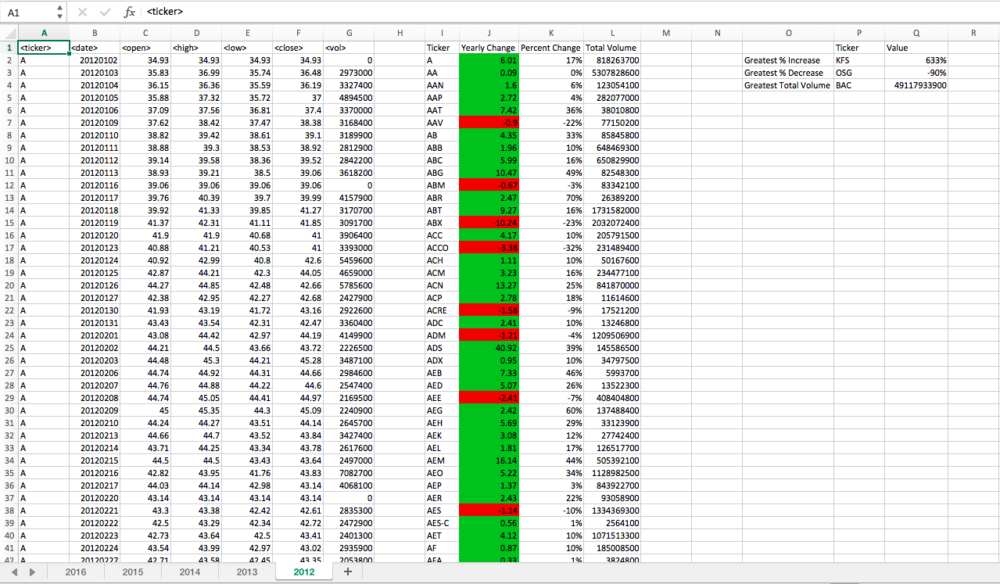
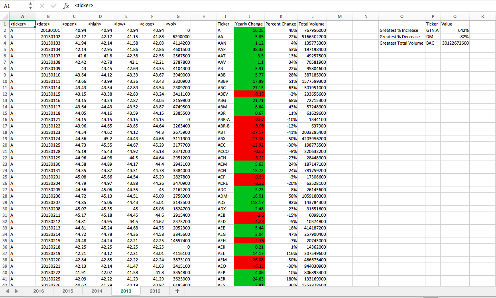
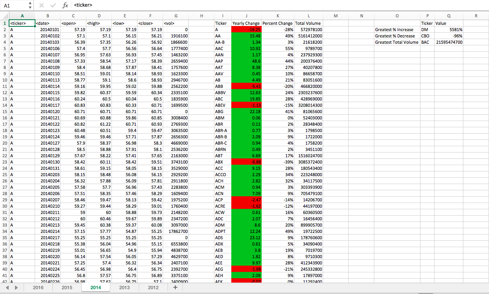
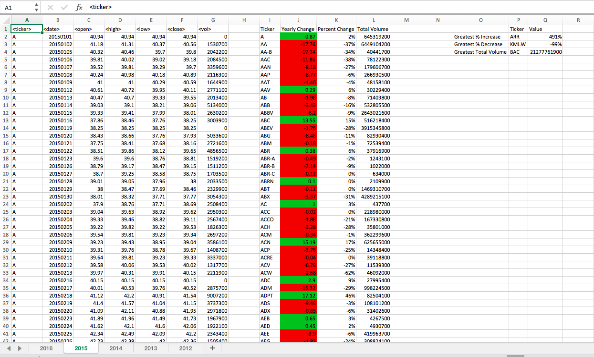
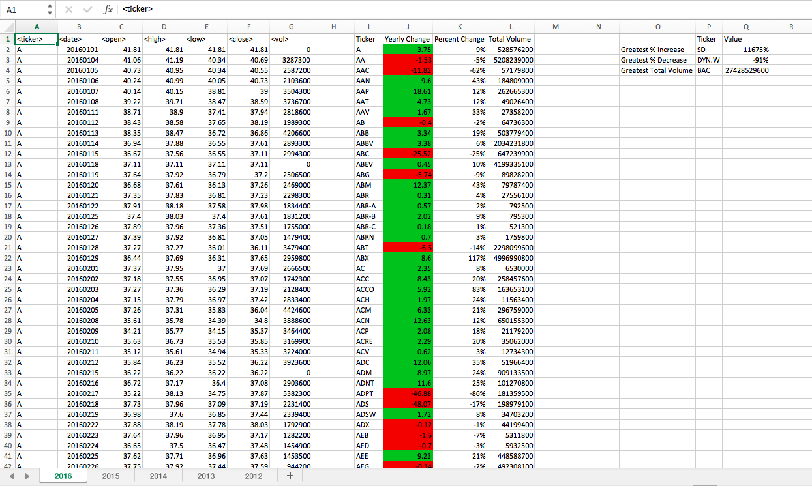

# Unit 2 | Assignment - The VBA of Wall Street

### Background

In this assignment I used VBA scripting to analyze stock market data from 2012 to 2016. 

### Analysis Conducted

* I created a script to loop through all the stocks and take the following info:

    * Yearly change from what the stock opened the year at to what the closing price was.

    * The percent change from the what it opened the year at to what it closed 

    * The total Volume of the stock

    * Ticker symbol

    * The stock with the "Greatest % increase", "Greatest % Decrease" and "Greatest total volume".

*(positive changes in green and negative changes in red)

The script was written to allow it to run on every worksheet just by running it once.*

### See analysis output screen captures by year below:

**2012**

**2013**

**2014**

**2015**

**2016**

